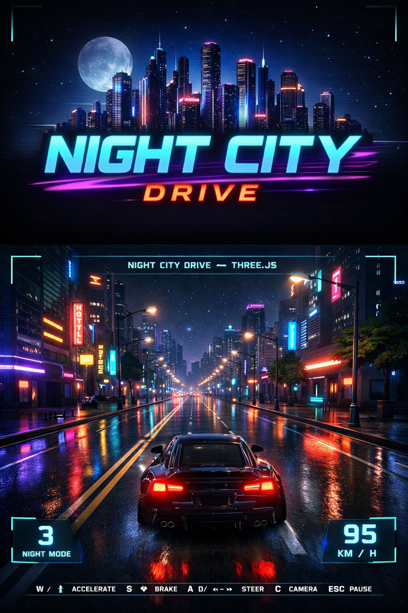

# Night City Drive 🚗🌃

# Night City Drive 🚗🌃

  

Night City Drive is a browser-based 3D driving project I built with JavaScript and Three.js. I aimed to experiment with WebGL graphics and create an interactive night city where users can drive a car and explore the scene.

The environment is created procedurally with roads, buildings, streetlights, trees, and neon lights to give it a cyberpunk night feel. The city looks alive with glowing windows, blinking lights, and dynamic lighting effects that add depth.

The car system includes basic driving physics like acceleration, braking, steering, and friction. The vehicle also has working headlights, taillights, wheel rotation, and multiple camera modes including chase camera, hood view, cockpit view, and cinematic orbit mode.

I added a pause menu with settings where users can turn on or off features such as night mode, engine sound, background music, FPS counter, and car color customization. The interface has a minimal futuristic HUD style inspired by racing games.

This project improved my understanding of 3D graphics, scene management, lighting systems, camera control, and interactive gameplay logic in the browser.

## 🎮 Play Online

https://darshilking208.github.io/night-city-drive/

## 🎮 Controls

W / Arrow Up – Accelerate
S / Arrow Down – Brake
A / Arrow Left – Steer Left
D / Arrow Right – Steer Right
C – Change Camera Mode
ESC – Pause Menu

## 🚀 Future Improvements

• Better physics
• More vehicles
• Weather effects (rain / fog)
• Larger open city

Created by **Darshil Prajapati**
